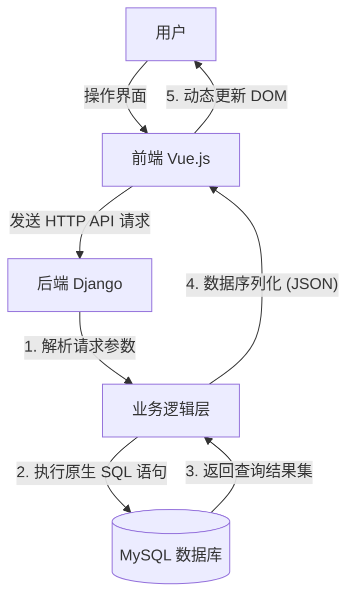
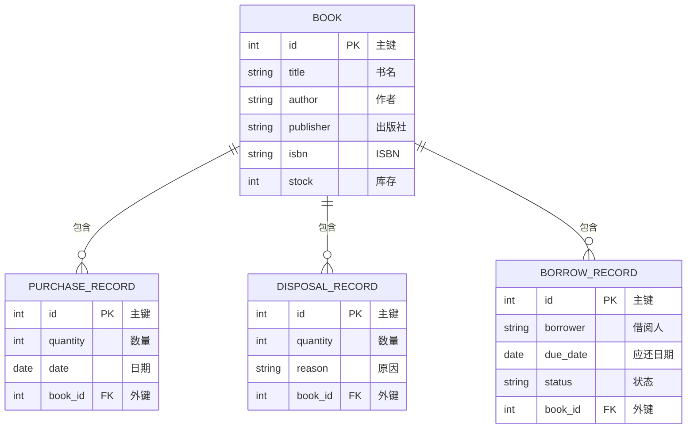

# 数据库课程设计实验报告


---

## 1. 实验名称

**基于 Web 的全栈图书管理系统数据库设计与实现**

## 2. 实验目的

1.  **深化数据库理论理解**：通过从零设计一个完整的应用系统，深入理解数据库系统原理、E-R 模型设计、范式理论以及表结构设计（主键、外键、完整性约束）。
2.  **掌握 SQL 语言实战**：在实际开发中摒弃 ORM 框架的自动封装，显式地使用原生 SQL 语句进行数据定义（DDL）、数据查询（`SELECT`, `JOIN`, `GROUP BY`）、数据操纵（`INSERT`, `UPDATE`, `DELETE`）以及事务控制（`TRANSACTION`）。
3.  **理解现代软件架构**：实践“前后端分离”的开发模式，理解前端（Vue.js）、后端（Django）与数据库（MySQL）之间的数据交互流程。
4.  **提升工程实践能力**：锻炼需求分析、系统设计、编码实现以及排查解决复杂技术问题的能力。

## 3. 实验环境及工具

| 类别           | 工具名称              | 版本/说明 | 核心作用                         |
| :------------- | :-------------------- | :-------- | :------------------------------- |
| **操作系统**   | Windows               | 11        | 开发与运行环境                   |
| **数据库**     | MySQL                 | 8.0+      | 系统核心数据的持久化存储         |
| **数据库管理** | MySQL Workbench       | -         | 数据库设计、SQL 调试与管理       |
| **后端语言**   | Python                | 3.10      | 编写后端业务逻辑与数据库交互代码 |
| **后端框架**   | Django                | 5.2       | 提供 Web 服务与 API 接口         |
| **代码编辑器** | Visual Studio Code    | -         | 编写与调试前后端代码             |
| **前端技术栈** | Vue.js 3, Vite, Axios | -         | 构建用户交互界面与发送 HTTP 请求 |
| **前端 UI 库** | Element Plus          | -         | 提供表格、表单、弹窗等 UI 组件   |
| **可视化库**   | ECharts               | -         | 实现库存与借阅数据的可视化统计   |

## 4. 实验原理和具体步骤

为满足实验对 SQL 语言使用的要求，在后端视图中摒弃了 ORM 的自动操作，全部采用 connection.cursor() 执行原生 SQL。

### 4.1 系统架构设计

本系统采用 B/S（Browser/Server）架构，并实行前后端分离：

*   **前端**：负责页面渲染和用户交互，通过 Axios 发送异步 HTTP 请求。
*   **后端**：Django 接收请求，通过 Python 的 `django.db.connection` 执行原生 SQL 语句操作 MySQL 数据库，并将结果以 JSON 格式返回。

**系统交互流程图：**



### 4.2 数据库概念设计 (E-R 图)

根据需求分析，系统包含图书、采购、淘汰、借阅四个核心实体。



### 4.3 数据库逻辑设计 (表结构)

基于 E-R 图，设计了以下四张核心数据表：

1.  **图书基本信息表 (`books_book`)**
    *   `id`: INT, 主键, 自增
    *   `title`: VARCHAR(200), 非空
    *   `author`: VARCHAR(100), 非空
    *   `isbn`: VARCHAR(20), 唯一约束
    *   `stock`: INT, 库存数量

2.  **采购记录表 (`books_purchaserecord`)**
    *   `id`: INT, 主键, 自增
    *   `quantity`: INT, 采购数量
    *   `purchase_date`: DATE, 采购日期
    *   `book_id`: INT, 外键 (关联 `books_book.id`)

3.  **淘汰记录表 (`books_disposalrecord`)**
    *   `id`: INT, 主键, 自增
    *   `quantity`: INT, 淘汰数量
    *   `reason`: TEXT, 淘汰原因
    *   `book_id`: INT, 外键 (关联 `books_book.id`)

4.  **借阅记录表 (`books_borrowrecord`)**
    *   `id`: INT, 主键, 自增
    *   `borrower_name`: VARCHAR(50), 借阅人
    *   `status`: VARCHAR(10), 状态 ('borrowed'/'returned')
    *   `book_id`: INT, 外键 (关联 `books_book.id`)

### 4.4 关键代码实现 (原生 SQL 操作)

#### 4.4.1 建表语句 (DDL)

*注：使用 Django 的 `sqlmigrate` 工具生成标准 SQL DDL。*

```sql
CREATE TABLE `books_book` (
    `id` integer AUTO_INCREMENT NOT NULL PRIMARY KEY,
    `title` varchar(200) NOT NULL,
    `author` varchar(100) NOT NULL,
    `isbn` varchar(20) NOT NULL UNIQUE,
    `stock` integer UNSIGNED NOT NULL
);
-- 外键约束示例
ALTER TABLE `books_purchaserecord` ADD CONSTRAINT `fk_book_id` 
FOREIGN KEY (`book_id`) REFERENCES `books_book` (`id`);
```

#### 4.4.2 图书入库事务处理 (Transaction + DML)

在采购业务中，需要同时插入记录并更新库存，必须使用事务保证一致性。

```python
# books/views.py - PurchaseBookAPIView
from django.db import connection

def post(self, request, pk, *args, **kwargs):
    quantity = int(request.data.get('quantity'))
    with connection.cursor() as cursor:
        # 1. 开启事务
        cursor.execute("START TRANSACTION")
        try:
            # 2. 更新库存 (UPDATE)
            update_sql = "UPDATE books_book SET stock = stock + %s WHERE id = %s"
            cursor.execute(update_sql, [quantity, pk])
            
            # 3. 创建采购记录 (INSERT)
            insert_sql = """
                INSERT INTO books_purchaserecord 
                (book_id, quantity, purchase_date, operator_name) 
                VALUES (%s, %s, CURDATE(), %s)
            """
            cursor.execute(insert_sql, [pk, quantity, 'admin'])
            
            # 4. 提交事务
            cursor.execute("COMMIT")
        except Exception as e:
            # 5. 异常回滚
            cursor.execute("ROLLBACK")
            return Response({'error': str(e)}, status=400)
            
    return Response({'status': 'success'})
```

#### 4.4.3 数据统计聚合查询 (Aggregation)

使用 `GROUP BY` 和 `COUNT` 等函数进行多维数据分析。

```python
# books/views.py - StatisticsAPIView
def get(self, request, *args, **kwargs):
    with connection.cursor() as cursor:
        # 统计借阅次数最多的 Top 5 图书
        sql = """
            SELECT b.title, COUNT(br.id) as borrow_count
            FROM books_borrowrecord br
            JOIN books_book b ON br.book_id = b.id
            GROUP BY b.title
            ORDER BY borrow_count DESC
            LIMIT 5
        """
        cursor.execute(sql)
        top_5_data = cursor.fetchall()
    # ... 数据处理与返回 ...
```

## 5. 实验总结

### 5.1 遇到的问题及解决方案

1.  **ORM 与原生 SQL 的冲突**：
    *   **问题**：习惯使用 Django ORM 进行开发，但实验要求使用 SQL 语言，初期不知如何结合。
    *   **解决**：查阅 Django 文档，学习使用 `django.db.connection` 对象。重构了所有视图函数，手动编写 SQL 语句来替代 `Book.objects.all()` 等 ORM 调用，并自己实现了 `dictfetchall` 函数将数据库游标结果转换为 JSON 友好的字典格式。

2.  **数据表不存在错误 (Table doesn't exist)**：
    *   **问题**：新增 `PurchaseRecord` 模型后，后端报错 500，提示表不存在。
    *   **解决**：通过阅读 Traceback 日志，意识到虽然定义了模型类，但未同步到数据库。执行了 `python manage.py makemigrations` 生成迁移文件，再执行 `python manage.py migrate` 完成了建表操作。

3.  **SQL 注入风险**：
    *   **问题**：最初使用字符串拼接（f-string）来构建 SQL 查询。
    *   **解决**：意识到安全性问题，改用**参数化查询**（`cursor.execute(sql, [params])`），由数据库驱动处理转义，确保了系统的安全性。

### 5.2 收获与体会

通过本次实验，我不仅构建了一个功能完善的图书管理系统，更重要的是透彻理解了 Web 应用背后的数据流转机制。

1.  **SQL 能力提升**：以前只在课堂上写 SQL，这次在真实项目中大量使用了 `JOIN`、子查询和事务控制，真正体会到了 SQL 在处理复杂数据逻辑时的强大与高效。
2.  **全栈开发视角**：亲手搭建了从前端 Vue 组件到后端 API 再到数据库存储的完整链路，理解了 CORS 跨域、HTTP 状态码以及 JSON 数据格式在前后端交互中的重要性。
3.  **工程化思维**：学会了如何通过日志排查 Bug，如何使用 Git 或迁移工具管理数据库版本。

本次实验将理论知识转化为实际代码，极大地提升了我的数据库设计能力和软件工程实践水平。